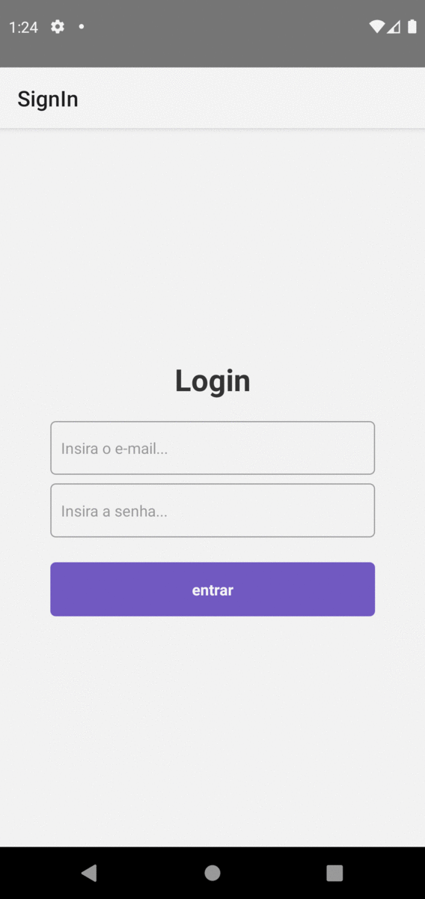

# Autenticação no React Native / ReactJS com Context API & Hooks | Masterclass #12

## Sobre projeto
Projeto desenvolvido durante a aula masterclass#12 da rocketseat e adicionado ao meu repositório para futuras consultas.

## RN-Auth
Utilizado: 
- Context API
- Async Storage
- React Hooks
- Axios
